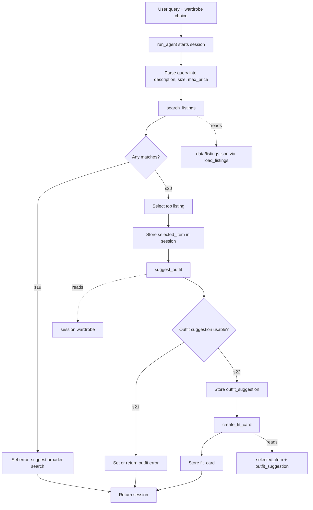

# FitFindr — planning.md

> Complete this document before writing any implementation code.
> Your spec and agent diagram are what you'll use to direct AI tools (Claude, Copilot, etc.) to generate your implementation — the more specific they are, the more useful the generated code will be.
> Your planning.md will be reviewed as part of your submission.
> Update it before starting any stretch features.

---

## Tools

List every tool your agent will use. For each tool, fill in all four fields.
You must have at least 3 tools. The three required tools are listed — add any additional tools below them.

### Tool 1: search_listings

**What it does:**
<!-- Describe what this tool does in 1–2 sentences -->
Searches the mock secondhand listings dataset for items that match the user's desired item description, optional size, and optional maximum price. It should use `load_listings()` from `utils/data_loader.py`, filter out listings that do not meet hard constraints, then rank the remaining listings by relevance to the description.

**Input parameters:**
<!-- List each parameter, its type, and what it represents -->
- `description` (str): ...
- `size` (str): ...
- `max_price` (float): ...
- `description` (str): Keywords or phrase describing what the user wants, such as `"vintage graphic tee"` or `"black combat boots"`.
- `size` (str | None): Optional size filter from the user. Matching should be case-insensitive and allow partial matches, so `"M"` can match `"S/M"` or `"M"`.
- `max_price` (float | None): Optional maximum price in dollars. Listings above this price are filtered out.

**What it returns:**
<!-- Describe the return value — what fields does a result contain? -->
A list of listing dictionaries sorted by relevance, best match first. Each result contains the dataset fields: `id` (str), `title` (str), `description` (str), `category` (str), `style_tags` (list[str]), `size` (str), `condition` (str), `price` (float), `colors` (list[str]), `brand` (str | None), and `platform` (str).

**What happens if it fails or returns nothing:**
<!-- What should the agent do if no listings match? -->
Return an empty list rather than raising an error. The agent should tell the user no matching listings were found and suggest changing one or more constraints, such as increasing the budget, removing the size filter, or broadening the item description. The agent stops here and does not call `suggest_outfit`.

---

### Tool 2: suggest_outfit

**What it does:**
<!-- Describe what this tool does in 1–2 sentences -->
Suggests how to style the selected thrift listing with the user's existing wardrobe. When the wardrobe has items, it should recommend specific named pieces from that wardrobe; when the wardrobe is empty, it should give general styling advice for the new item.

**Input parameters:**
<!-- List each parameter, its type, and what it represents -->
- `new_item` (dict): The selected listing dictionary returned by `search_listings`, usually the top-ranked result.
- `wardrobe` (dict): A wardrobe object with an `items` key. Each item has `id`, `name`, `category`, `colors`, `style_tags`, and optional `notes`.

**What it returns:**
<!-- Describe the return value -->
A non-empty string with one or two outfit suggestions. For a populated wardrobe, the response should name specific closet items and explain the styling logic; for an empty wardrobe, it should describe what types of pieces would pair well with the listing.

**What happens if it fails or returns nothing:**
<!-- What should the agent do if the wardrobe is empty or no outfit can be suggested? -->
If the wardrobe is empty, return general styling guidance instead of failing. If `new_item` is missing or unusable, return a helpful error string and the agent should not call `create_fit_card` until a usable outfit suggestion exists.

---

### Tool 3: create_fit_card

**What it does:**
<!-- Describe what this tool does in 1–2 sentences -->
Creates a short, shareable caption-style "fit card" from the selected listing and outfit suggestion. The card should sound casual and social-media ready while naturally mentioning the item, price, platform, and outfit vibe.

**Input parameters:**
<!-- List each parameter, its type, and what it represents -->
- `outfit` (str): The outfit suggestion returned by `suggest_outfit`.
- `new_item` (dict): The selected listing dictionary, used for title, price, platform, style tags, and other item details.

**What it returns:**
<!-- Describe the return value -->
A `str` containing a 2–4 sentence fit-card caption that the user could post or adapt. The caption should mention the selected item, its price, and its platform naturally, and should summarize the outfit vibe from the styling suggestion. If the outfit suggestion is missing or incomplete, it returns a clear error message string instead of raising an exception.

**What happens if it fails or returns nothing:**
<!-- What should the agent do if the outfit data is incomplete? -->
If `outfit` is empty or `new_item` is missing key details, return a descriptive error message string instead of raising an exception. The agent should show that message in place of the fit card and keep the listing and outfit information available for debugging or retrying.

---

### Additional Tools (if any)

<!-- Copy the block above for any tools beyond the required three -->
No additional tools for the required version. The project can be completed with `search_listings`, `suggest_outfit`, and `create_fit_card`.

---

## Planning Loop

**How does your agent decide which tool to call next?**
<!-- Describe the logic your planning loop uses. What does it look at? What conditions change its behavior? How does it know when it's done? -->
The agent starts by parsing the user query into `description`, optional `size`, and optional `max_price`. I will use simple deterministic parsing for price and size, such as looking for patterns like `under $30`, `$30`, `size M`, or `in size M`, and treat the remaining item phrase as the description.

After parsing, the agent always calls `search_listings` first because every successful interaction needs a real listing. If search returns an empty list, the agent sets an error message and stops. If results exist, the agent selects the first result as `selected_item`, calls `suggest_outfit(selected_item, wardrobe)`, and only calls `create_fit_card(outfit_suggestion, selected_item)` if the outfit suggestion is non-empty. The loop is done when either an error is set or the session has a selected item, outfit suggestion, and fit card.

---

## State Management

**How does information from one tool get passed to the next?**
<!-- Describe how your agent stores and accesses state within a session. What data is tracked? How is it passed between tool calls? -->
The agent uses one session dictionary for a single user interaction. The session stores the original query, parsed search parameters, raw search results, selected listing, wardrobe, outfit suggestion, fit card, and any error message.

The state fields are:
- `query`: Original user request.
- `parsed`: Extracted `description`, `size`, and `max_price`.
- `search_results`: List returned by `search_listings`.
- `selected_item`: Top listing selected from `search_results`.
- `wardrobe`: Wardrobe dict passed into the agent.
- `outfit_suggestion`: String returned by `suggest_outfit`.
- `fit_card`: String returned by `create_fit_card`.
- `error`: `None` on success, or a user-facing message if the run stops early.

Tool outputs become the next tool's inputs: `selected_item` is passed to `suggest_outfit`, and `outfit_suggestion` plus `selected_item` are passed to `create_fit_card`.

---

## Error Handling

| Tool | Failure mode | Agent response |
|------|-------------|----------------|
| search_listings | No results match the query | |
| suggest_outfit | Wardrobe is empty | |
| create_fit_card | Outfit input is missing or incomplete | |
| search_listings | No results match the query | Set `session["error"]` to a helpful message, suggest broadening the search, and stop before outfit generation. |
| suggest_outfit | Wardrobe is empty | Return general styling advice for the new item instead of naming closet pieces; continue to `create_fit_card` if the advice is non-empty. |
| create_fit_card | Outfit input is missing or incomplete | Return a descriptive error string and show it to the user instead of crashing. |

---

## Architecture

<!-- Draw a diagram of your agent showing how the components connect:
     User input → Planning Loop → Tools (search_listings, suggest_outfit, create_fit_card)
                                                                          ↕
                                                                   State / Session
     Show what triggers each tool, how state flows between them, and where error paths branch off.
     ASCII art, a Mermaid diagram (https://mermaid.js.org/syntax/flowchart.html), or an embedded
     sketch are all fine. You'll share this diagram with an AI tool when asking it to implement
     the planning loop and each individual tool. -->

The session dictionary is the shared state layer between the planning loop and tools. The only branch that stops immediately is a no-result search, because calling `suggest_outfit` without a selected listing would produce a misleading response.

---

## AI Tool Plan
     before trusting it" is a plan. -->

**Milestone 3 — Individual tool implementations:**
I will use ChatGPT with the Tool 1, Tool 2, and Tool 3 specs from this file plus the existing `tools.py` docstrings. For `search_listings`, I will ask it to implement deterministic filtering and relevance scoring using `load_listings()` only, then verify with queries like `"vintage graphic tee under $30"`, `"90s track jacket size M"`, and `"designer ballgown size XXS under $5"`. For `suggest_outfit` and `create_fit_card`, I will ask it to build clear Groq prompts, handle empty inputs gracefully, and return strings; I will verify both with `get_example_wardrobe()` and `get_empty_wardrobe()`.

**Milestone 4 — Planning loop and state management:**
I will give ChatGPT the Planning Loop, State Management, Error Handling, and Architecture sections, then ask it to implement `run_agent()` in `agent.py` so the code follows the documented state fields and stopping rules. I will verify that successful runs fill `selected_item`, `outfit_suggestion`, and `fit_card`, while no-result searches set `error` and leave later outputs as `None`. After that, I will implement `handle_query()` in `app.py` and manually test the Gradio examples to make sure the three output panels match the session state.

---

## A Complete Interaction (Step by Step)

Write out what a full user interaction looks like from start to finish — tool call by tool call. Use a specific example query.
FitFindr helps a user shop secondhand by first searching listings that match the requested item, size, budget, and style language, then styling the best match with pieces from the user's wardrobe, then turning the outfit into a short social-style fit card. `search_listings` is triggered by the user's shopping request; if it returns no matches, the agent explains what to broaden or change and stops instead of calling `suggest_outfit`. When a listing is found, `suggest_outfit` uses the selected item plus the wardrobe, and `create_fit_card` runs only after a usable outfit suggestion exists.

**Example user query:** "I'm looking for a vintage graphic tee under $30. I mostly wear baggy jeans and chunky sneakers. What's out there and how would I style it?"

**Step 1:**
<!-- What does the agent do first? Which tool is called? With what input? -->
The agent parses the shopping request and calls `search_listings(description="vintage graphic tee", size=None, max_price=30.0)`. The tool searches listing fields such as title, description, category, style_tags, size, condition, price, colors, brand, and platform, then returns matching listings sorted by relevance.
**Step 2:**
<!-- What happens next? What was returned from step 1? What tool is called now? -->
The agent selects the top returned listing, such as "Graphic Tee — 2003 Tour Bootleg Style" for $24 on Depop, and stores it as `new_item`. It then calls `suggest_outfit(new_item=<selected listing>, wardrobe=<user wardrobe>)`, using wardrobe items like baggy jeans, chunky sneakers, boots, jackets, and accessories to build a cohesive look.

**Step 3:**
<!-- Continue until the full interaction is complete -->
If `suggest_outfit` returns a usable outfit, the agent calls `create_fit_card(outfit=<outfit suggestion>, new_item=<selected listing>)`. This turns the listing and styling advice into a concise caption-style fit card that mentions the thrifted item, price, platform, and outfit vibe.

**Final output to user:**
<!-- What does the user actually see at the end? -->
The user sees the best matching listing, a styling suggestion using their wardrobe, and a ready-to-post fit card. If no listings match the search, the user instead sees a helpful message suggesting changes like increasing the budget, removing the size filter, or broadening the style keywords, and the agent does not continue to outfit or fit-card generation.

